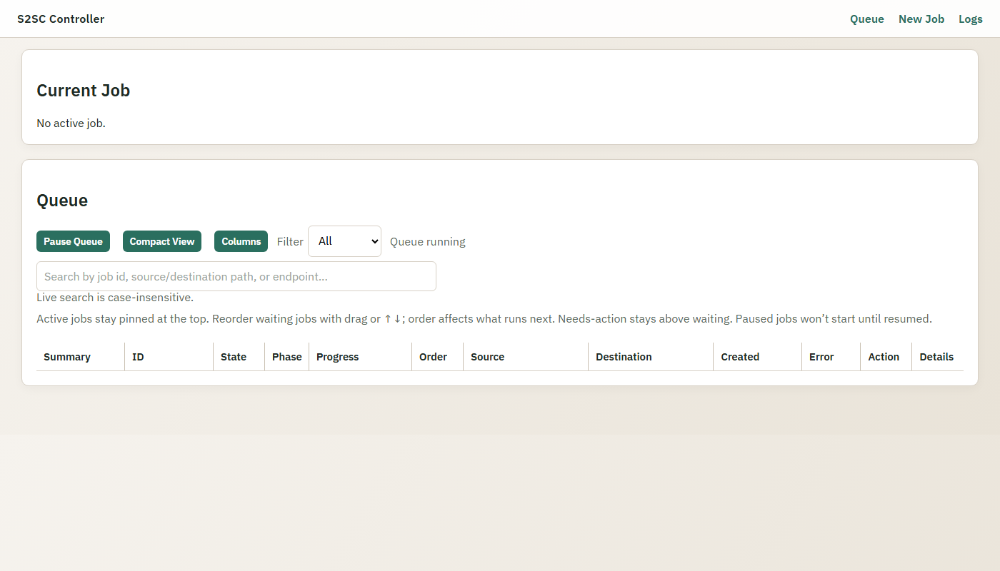
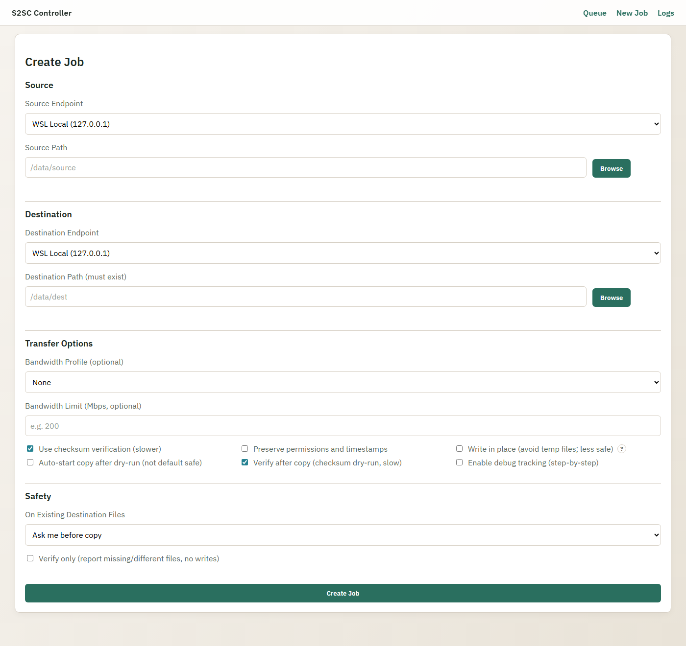
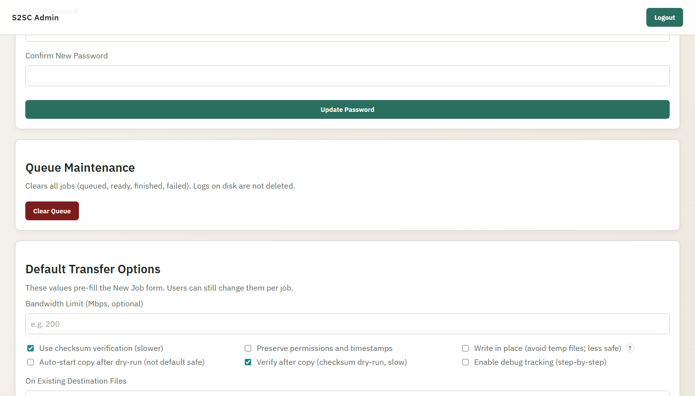

<div align="center">

# 🚀 S2SC — Server-to-Server Copy Controller

**Safe, resumable server-to-server file transfers via rsync over SSH — with a web UI, job queue, and dry-run safety gates.**

[]()
[]()
[]()

> 🔒 Private source — this repository is a project showcase.

</div>

---

## 🎯 The Problem It Solves

Copying large datasets between servers usually means routing all the data through the machine running the command — slow, wasteful, and brittle on flaky connections.

S2SC fixes this: the controller SSHes into the **source** host and runs rsync there, so data flows **directly** from source to destination without touching the controller machine.

The other problem is safety. Bulk copies are hard to undo. S2SC enforces a dry-run gate before every transfer, requires explicit approval to start, and never deletes or overwrites by default.

---

## ⚙️ How It Works

```
Controller (Linux)
  │
  ├─── SSH ──► Source host
  │              │
  │              └─── rsync over SSH ──► Destination host
  │
  └─── Web UI ◄── Browser (any machine on the network)
```

1. 📝 **Create a job** — pick source and destination endpoints, set paths
2. 🔍 **Dry-run prep** — controller scans files, counts size, detects conflicts
3. 👀 **Review** — inspect totals and any existing-file conflicts in the UI
4. ✅ **Approve & start** — one click triggers the actual rsync
5. 📊 **Monitor** — live progress, transfer rate, and ETA
6. ✔️ **Optional verify** — post-copy checksum dry-run confirms integrity

---

## ✨ Features

### 🛡️ Safety Model

- **Dry-run gate** — every job runs a prep scan before copy; copy never starts automatically
- **No deletes, no overwrites** — `--ignore-existing` by default; destination files are never touched
- **Destination must exist** — no accidental directory creation
- **Allowlist-only paths** — each endpoint declares its allowed base directories; paths outside are rejected
- **Conflict policy** — choose Ask / Skip / Stop for existing destination files
- **Verify-only mode** — checksum dry-run against an already-copied destination; reports mismatches without writing anything

### 📋 Job Queue

- Sequential execution — one active transfer at a time
- Reorderable queue for waiting jobs
- Cancel, pause, and restart support
- Job states: `queued → preparing → ready → copying → finished / failed / canceled`

### 🖥️ Web UI

- Queue overview with live status, progress bar, rate, and ETA
- Job detail view with per-job rsync log and file list
- New job form — endpoint picker, path entry, policy and flag configuration
- Admin UI for token management, endpoint management, and password rotation

### ⚙️ Per-Job Transfer Options

| Option | Default |
|:---|:---|
| On existing files | Ask |
| Checksum verify | Off |
| Preserve permissions + timestamps | On |
| Write-in-place | Off |
| Auto-start after prep | Off |
| Verify after copy | Off |
| Bandwidth limit | None |

---

## 🛠️ Tech Stack

| Layer | Technology |
|:---|:---|
| Backend | Python 3.10+ / FastAPI |
| Web server | Uvicorn (ASGI) |
| Templating | Jinja2 |
| Database | SQLite (job state, logs) |
| Transfer engine | rsync over SSH via Paramiko |
| Auth | Token-based (queue UI) + session-based (admin UI) |
| Password storage | PBKDF2-SHA256 |
| Frontend | Vanilla JS + CSS |

---

## 🏗️ Architecture

```
app/
  main.py           FastAPI routes — queue UI, job API, admin UI
  config.py         Config loader + endpoint validation
  transfer.py       rsync argument builder + SSH execution (Paramiko)
  queue.py          Sequential job queue, state machine
  state.py          In-memory job state + SQLite persistence
  storage.py        SQLite schema, reads/writes
  ssh.py            SSH connection pool + remote command runner
  security.py       Token auth, password hashing, session management
  validators.py     Path allowlist enforcement
  logging_setup.py  Per-job + global log routing
  templates/        Jinja2 HTML templates
  static/           app.js + app.css (no build step required)
  tests/            pytest suite
```

**No agent on endpoints** — the controller SSHes in and runs a single rsync command. Source and destination only need rsync + SSH.

**Config-driven endpoints** — servers are declared in `config.json` with host, user, port, OS type, and allowed base directories.

---

## 📸 Screenshots

**Queue — live status, filter, and reorder**


**New Job — endpoint picker with transfer options**


**Admin — default options and queue maintenance**


---

## 📊 Status

Active development. 🔒 Private source — this repository is a project showcase.
